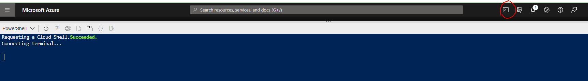

# Prerequisites

## Azure Cloud Platform

This tutorial leverages the [Azure Cloud Platform](https://azure.microsoft.com/en-us/) to streamline provisioning of the compute infrastructure required to bootstrap a Kubernetes cluster from the ground up. [Sign up](https://azure.microsoft.com/en-us/free/) for $200 in free credits (it might require a credit card).

## Configure Azure Cloud Shell

All the cloud commands executed in this tutorial can be performed directly from the browser using the cloud shell.

[How to configure the cloud shell in my subscription](https://docs.microsoft.com/en-us/azure/cloud-shell/overview)

__ We will configure a jumpbox in the tutorial, you don't need to install anything on your pc. Apart from a simple SSH terminal like [Putty](https://www.putty.org/) which it will be use to connect to the VMs. __

## Running Commands in Parallel with tmux

[tmux](https://github.com/tmux/tmux/wiki) can be used to run commands on multiple compute instances at the same time. Labs in this tutorial may require running the same commands across multiple compute instances, in those cases consider using tmux and splitting a window into multiple panes with synchronize-panes enabled to speed up the provisioning process.

> The use of tmux is optional and not required to complete this tutorial.

> Enable synchronize-panes by pressing `ctrl+b` followed by `shift+:`. Next type `set synchronize-panes on` at the prompt. To disable synchronization: `set synchronize-panes off`.

Next: [Installing the Client Tools](02-client-tools.md)
