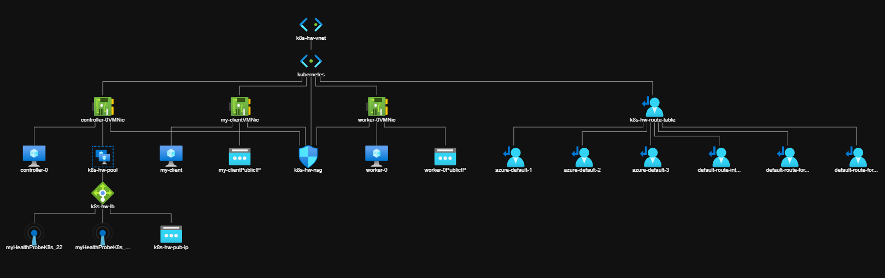

# Provisioning Compute Resources

Kubernetes requires a set of machines to host the Kubernetes control plane and the worker nodes where containers are ultimately run. In this lab you will provision the compute resources required for running a secure and highly available Kubernetes cluster across a single Azure Region. West Europe.

## Networking

The Kubernetes [networking model](https://kubernetes.io/docs/concepts/cluster-administration/networking/#kubernetes-model) assumes a flat network in which containers and nodes can communicate with each other. In cases where this is not desired [network policies](https://kubernetes.io/docs/concepts/services-networking/network-policies/) can limit how groups of containers are allowed to communicate with each other and external network endpoints.

> Setting up network policies is out of scope for this tutorial.

__All the commands listed in this page can be executed from the Azure Shell.__

### Virtual Private Cloud Network

In this section a dedicated [Virtual Network](https://docs.microsoft.com/en-us/azure/virtual-network/virtual-networks-overview) (VNet) will be setup to host the Kubernetes cluster.

Create the `k8s-hardway-rg` resource group:

```
az group create -l westeurope -n k8s-hardway-rg
```

Create the `k8s-hw-vnet` custom VNet network:

```
az network vnet create -g k8s-hardway-rg -n k8s-hw-vnet --address-prefixes 10.0.0.0/8
```

A subnet must be provisioned with an IP address range large enough to assign a private IP address to each node in the Kubernetes cluster.

Create the `kubernetes` subnet in the `k8s-hw-vnet` VPC network:

```
az network vnet subnet create -g k8s-hardway-rg --vnet-name k8s-hw-vnet -n kubernetes --address-prefixes 10.240.0.0/24
```

> The `10.240.0.0/24` IP address range can host up to 254 compute instances.

### Firewall Rules

We will need to create an [NSG](https://docs.microsoft.com/en-us/azure/virtual-network/network-security-groups-overview) with some inbound rules configured and assign it to the subnet:

```
az network nsg create -g k8s-hardway-rg -n k8s-hw-nsg --tags k8s-hw

az network nsg rule create -g k8s-hardway-rg --nsg-name k8s-hw-nsg -n AllowInternal --priority 400 --source-address-prefixes 10.0.0.0/8 --destination-port-ranges '*' -direction Inbound --access Allow --protocol Tcp --description "Allow InternalTraffic"

az network nsg rule create -g k8s-hardway-rg --nsg-name k8s-hw-nsg -n AllowExternal22 --priority 401 --source-address-prefixes '*' --destination-port-ranges 22 --direction Inbound --access Allow --protocol Tcp --description "Allow ExternalTraffic for 22"

az network nsg rule create -g k8s-hardway-rg --nsg-name k8s-hw-nsg -n AllowExternal6443 --priority 402 --source-address-prefixes '*' --destination-port-ranges 6443 --direction Inbound --access Allow --protocol Tcp --description "Allow ExternalTraffic for 6443"

az network nsg rule create -g k8s-hardway-rg --nsg-name k8s-hw-nsg -n AllowInternal --priority 403 --source-address-prefixes 10.240.0.0/24 10.200.0.0/16 --destination-port-ranges '*' --direction Inbound --access Allow --protocol Tcp --description "Allow InternalTraffic K8s"

az network vnet subnet update -g k8s-hardway-rg -n kubernetes --vnet-name k8s-hw-vnet --network-security-group k8s-hw-nsg

```

### VMs and Availability Set

Deploy the required [VMs](https://azure.microsoft.com/en-us/services/virtual-machines/) and [AVS](https://docs.microsoft.com/en-us/azure/virtual-machines/availability-set-overview)

The compute instances in this lab will be provisioned using [Ubuntu Server](https://www.ubuntu.com/server) 20.04, which has good support for the [containerd container runtime](https://github.com/containerd/containerd). Each compute instance will be provisioned with a fixed private IP address to simplify the Kubernetes bootstrapping process.

The following VMs will be created

- 3 controllers Ubuntu VMs.
- 3 workers Ubuntu VMs.
- 1 jumpbox Ubuntu VM.

Create the `availabiltiy set`

```
az vm availability-set create -n k8s-hw-avs -g k8s-hardway-rg --platform-fault-domain-count 2 --platform-update-domain-count 2
```

Create 3 `controllers` VMs

```
for($i=0; $i -lt 3; $i++)
{
  az vm create -n controller-${i} -g k8s-hardway-rg --image UbuntuLTS --availability-set k8s-hw-avs --size Standard_B1ms --vnet-name k8s-hw-vnet --subnet kubernetes --nsg k8s-hw-nsg --admin-password "fC!8=3Hstz%!:eQr" --admin-username "myadmin" --public-ip-address '""'

  az vm auto-shutdown --resource-group k8s-hardway-rg --name controller-${i} --time 1130

	az network nic update -g k8s-hardway-rg -n controller-${i}VMNic --ip-forwarding true
}
```

Create 3 `workers` VMs

```
for($i=0; $i -lt 3; $i++)
{
  az vm create -n worker-${i} -g k8s-hardway-rg --image UbuntuLTS --availability-set k8s-hw-avs --size Standard_B1ms --vnet-name k8s-hw-vnet --subnet kubernetes --nsg k8s-hw-nsg --admin-password "fC!8=3Hstz%!:eQr" --admin-username "myadmin" --public-ip-address '""'

  az vm auto-shutdown --resource-group k8s-hardway-rg --name worker-${i} --time 1130

	az network nic update -g k8s-hardway-rg -n worker-${i}VMNic --ip-forwarding true
} 
```

Create 1 `jumpbox` VM

```
az vm create -n my-client -g k8s-hardway-rg --image UbuntuLTS --size Standard_B1ms --vnet-name k8s-hw-vnet --subnet kubernetes --nsg k8s-hw-nsg --admin-password "fC!8=3Hstz%!:eQr" --admin-username "myadmin" --public-ip-sku Standard --public-ip-address-allocation static

az vm auto-shutdown --resource-group k8s-hardway-rg --name my-client --time 1130

az network nic update -g k8s-hardway-rg -n my-clientVMNic --ip-forwarding true
```

## Frontend Public Load Balancer

An public [Azure Load Balancer](https://docs.microsoft.com/en-us/azure/load-balancer/load-balancer-overview) is required. This Load Balancer will be our entry point to reach the controllers over the public internet.

It will allow traffic on 2 ports: SSH (22) and K8s (6443).

```
az network public-ip create --resource-group k8s-hardway-rg --name k8s-hw-lb-pub-ip --sku Standard --dns-name kuberneteshardway --allocation-method Static

az network lb create --resource-group k8s-hardway-rg --name k8s-hw-lb --sku Standard --public-ip-address k8s-hw-lb-pub-ip --frontend-ip-name k8s-hw-pub-ip --backend-pool-name k8s-hw-pool

az network lb probe create --resource-group k8s-hardway-rg --lb-name k8s-hw-lb --name myHealthProbeK8s_22 --protocol tcp --port 22

az network lb probe create --resource-group k8s-hardway-rg --lb-name k8s-hw-lb --name myHealthProbeK8s_6443 --protocol tcp --port 6443

az network lb rule create --resource-group k8s-hardway-rg --lb-name k8s-hw-lb --name k8s_22_rule --protocol tcp --frontend-port 22 --backend-port 22 --frontend-ip-name k8s-hw-pub-ip --backend-pool-name k8s-hw-pool --probe-name myHealthProbeK8s_22 --disable-outbound-snat true  --idle-timeout 15 --enable-tcp-reset true

az network lb rule create --resource-group k8s-hardway-rg --lb-name k8s-hw-lb --name k8s_6443_rule --protocol tcp --frontend-port 6443 --backend-port 6443 --frontend-ip-name k8s-hw-pub-ip --backend-pool-name k8s-hw-pool --probe-name myHealthProbeK8s_6443 --disable-outbound-snat true  --idle-timeout 15 --enable-tcp-reset true
```
Let's add the controllers inside the backend pool:

```
for($i=0; $i -lt 3; $i++)
{
    az network nic ip-config address-pool add --address-pool k8s-hw-pool --ip-config-name ipconfigcontroller-${i} --nic-name controller-${i}VMNic --resource-group k8s-hardway-rg --lb-name k8s-hw-lb
} 
```

### Nat Gateway

To route the outbound traffic of the VNet a [Nat Gateway](https://docs.microsoft.com/en-us/azure/virtual-network/nat-gateway/nat-overview) will be used.

```
az network public-ip create --resource-group k8s-hardway-rg --name k8s-hw-nat-gw-pub-ip --sku Standard --dns-name kuberneteshardwayoutbound --allocation-method Static

az network nat gateway create --resource-group k8s-hardway-rg --name k8s-hw-nat-gw --location westeurope --public-ip-addresses  k8s-hw-nat-gw-pub-ip

az network vnet subnet update --resource-group k8s-hardway-rg --vnet-name k8s-hw-vnet --name kubernetes --nat-gateway k8s-hw-nat-gw

```

### User Defined Routes

In a PaaS scenario the route table will be automatically created/managed by the Cloud provider, like in the case of [AKS](https://azure.microsoft.com/en-us/services/kubernetes-service/). However, a [User Defined Table](https://docs.microsoft.com/en-us/azure/virtual-network/virtual-networks-udr-overview) is required in this tutorial.

The routing table will be used to allow communication between the K8S pods later.

Replace the Private IP of the workers inside the following configuration:

```

az network route-table create -g k8s-hardway-rg -n k8s-hw-route-table

az network route-table route create -g k8s-hardway-rg --route-table-name k8s-hw-route-table -n azure-default-1 --next-hop-type VnetLocal --address-prefix 10.0.0.0/8

az network route-table route create -g k8s-hardway-rg --route-table-name k8s-hw-route-table -n azure-default-2 --next-hop-type None --address-prefix 192.168.0.0/16

az network route-table route create -g k8s-hardway-rg --route-table-name k8s-hw-route-table -n azure-default-3 --next-hop-type None --address-prefix 100.64.0.0/10

az network route-table route create -g k8s-hardway-rg --route-table-name k8s-hw-route-table -n default-route-internet --next-hop-type Internet --address-prefix 0.0.0.0/0

az network route-table route create -g k8s-hardway-rg --route-table-name k8s-hw-route-table -n default-route-for-subnet --next-hop-type VnetLocal --address-prefix 10.240.0.0/24

az network route-table route create -g k8s-hardway-rg --route-table-name k8s-hw-route-table -n default-route-for-worker0 --next-hop-type VirtualAppliance --address-prefix 10.200.0.0/24 --next-hop-ip-address 10.240.0.5

az network route-table route create -g k8s-hardway-rg --route-table-name k8s-hw-route-table -n default-route-for-worker1 --next-hop-type VirtualAppliance --address-prefix 10.200.1.0/24 --next-hop-ip-address 10.240.0.6

az network route-table route create -g k8s-hardway-rg --route-table-name k8s-hw-route-table -n default-route-for-worker2 --next-hop-type VirtualAppliance --address-prefix 10.200.2.0/24 --next-hop-ip-address 10.240.0.7

az network vnet subnet update --resource-group k8s-hardway-rg --vnet-name k8s-hw-vnet --name kubernetes --route-table k8s-hw-route-table

```

### Service Principal

Let's create a [Service Principal](https://docs.microsoft.com/en-us/azure/active-directory/develop/app-objects-and-service-principals) This will be used to execute Az Cli commands from the jumpbox. __Make sure to take note of the output of this command__

```
az ad sp create-for-rbac --name k8s-hw-sp --role Contributor

```

### Result

__The resulting topology should look like this:__



Next: [Install Client Tools on the jumpbox](03-client-tools.md)
